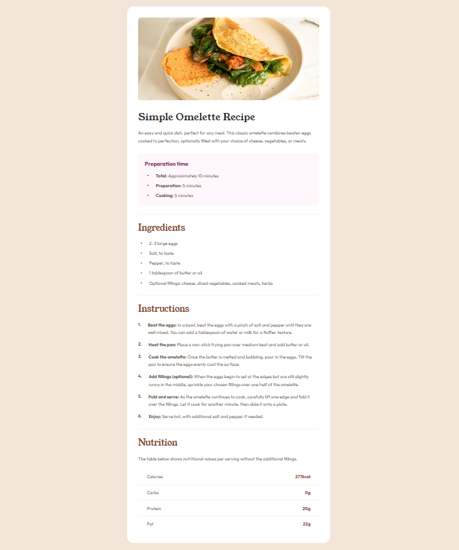

# Simple Omelette Recipe Page

A clean, responsive recipe page built with React and Tailwind CSS. This project is a solution to the [Frontend Mentor Recipe Page Challenge](https://www.frontendmentor.io/learning-paths/getting-started-on-frontend-mentor-XJhRWRREZd/challenge/65e6f48617e502f0b6ca3d02/start).

## 🎯 Overview

### The challenge

Users should be able to:

- View the optimal layout for the page depending on their device's screen size
- See hover states for all interactive elements on the page
- View the recipe with clearly structured sections (preparation time, ingredients, instructions, nutrition)

### Links

- Solution URL: [frontendmentor.io](https://www.frontendmentor.io/learning-paths/getting-started-on-frontend-mentor-XJhRWRREZd/challenge/65e6f48617e502f0b6ca3d02/start)
- Live Site URL: [recipe-page]()

## ✨ Features

- **Fully Responsive** - Optimized for mobile, tablet, and desktop screens
- **Data-Driven Content** - Recipe content is stored in arrays for easy maintenance
- **Clean Typography** - Uses a combination of serif and sans-serif fonts
- **Accessible** - Semantic HTML and proper heading hierarchy
- **Interactive Elements** - Hover states and visual feedback (if applicable)

## 🛠️ Technologies Used

- **React 18** - UI Library
- **TypeScript** (optional) - Type safety
- **Tailwind CSS** - Utility-first CSS framework
- **Lucide React** - Icon library for bullet points
- **Vite** - Build tool and development server
